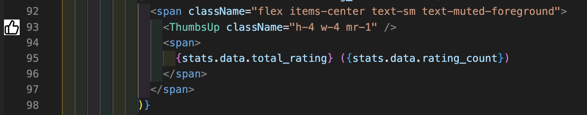

# Icon Preview

Preview icons directly in your VS Code editor gutter or inline. Perfect for React projects using icon libraries like Lucide.

## Features

- **Gutter/Inline Preview**: See icon previews next to your code
- **Lucide Support**: Automatic icon fetching from Lucide CDN
- **JSDoc @preview Tags**: Works with `@preview` tags in component definitions
- **Customizable**: Adjust icon size, color, and display position



## How It Works

When you import a component that has a `@preview` tag in its JSDoc comment, the icon preview will appear in the gutter (or inline) where you use that component.

### Supported Formats

```typescript
/**
 * @preview https://lucide.dev/icons/thumbs-up
 */
export const ThumbsUpIcon = () => <ThumbsUp />;

/**
 * @preview 
 */
export const CustomIcon = () => <svg>...</svg>;
```

## Settings

| Setting | Default | Description |
|---------|---------|-------------|
| `iconPreview.enabled` | `true` | Enable/disable icon preview |
| `iconPreview.imageSize` | `16` | Size of the icon in pixels |
| `iconPreview.svgColor` | `#ffffff` | Color for SVG icons (replaces `currentColor`) |
| `iconPreview.position` | `gutter` | Display position: `gutter` or `inline` |

## Supported Icon Libraries

- [Lucide](https://lucide.dev) - URLs like `https://lucide.dev/icons/icon-name` are automatically converted to CDN URLs
- Any icon library that uses `@preview` tags with image URLs or data URIs

## Requirements

- VS Code 1.74.0 or higher
- TypeScript/JavaScript language support for Go to Definition

## License

MIT
